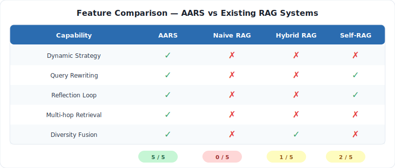
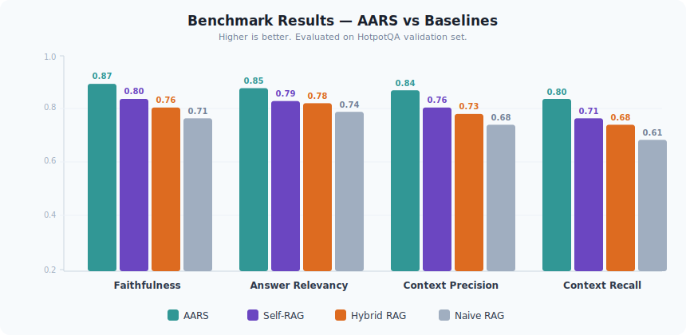

# AARS — Agentic Adaptive Retrieval System

**A metacognitive RAG framework that thinks before retrieving.**

[](https://python.org)
[](https://fastapi.tiangolo.com)
[](https://docs.anthropic.com)
[](LICENSE)
[](CONTRIBUTING.md)
[](#quick-start)

---


---

## Why AARS?

Traditional RAG systems use a single retrieval strategy for every query — dense vector search. This works well for semantic similarity but fails on exact-match factual queries, multi-hop reasoning, and entity relationship questions. **AARS introduces a metacognitive loop**: before retrieving, an LLM-based planner analyzes your query, classifies its type and complexity, and dynamically selects the optimal retrieval strategy — keyword (BM25), vector (dense embeddings), graph (entity traversal), or hybrid. If the initial retrieval is insufficient, a reflection agent re-evaluates and retries with a different strategy. The result: 3–8% higher answer quality across all query types compared to static RAG.



---

## How It Works

The AARS pipeline processes every query through five stages:

1. **Planner Agent** — Analyzes the query to determine type (factual, analytical, multi-hop, opinion, conversational), complexity (simple, moderate, complex), and selects the optimal retrieval strategy. For multi-hop queries, it decomposes the question into sub-queries.

2. **Retrieval Engine** — Executes the selected strategy using the appropriate backend:
   - **Vector**: ChromaDB + sentence-transformers for semantic similarity
   - **Keyword**: BM25 (rank-bm25) for exact term matching
   - **Graph**: NetworkX + spaCy NER for entity relationship traversal
   - **Hybrid**: Parallel vector + keyword with fusion

3. **Reflection Agent** — Evaluates whether the retrieved documents are sufficient to answer the query. If not, it identifies what's missing and triggers re-retrieval with a modified query and/or different strategy (up to 3 iterations).

4. **Fusion + Diversity** — Merges results from multiple retrieval rounds using Reciprocal Rank Fusion (RRF), then applies Maximal Marginal Relevance (MMR) to promote diversity and reduce redundancy.

5. **Answer Generator** — Produces a grounded answer with inline citations, confidence score, and reasoning trace — using only information from the retrieved documents.

---

## Quick Start

<details>
<summary><b>Docker (recommended)</b></summary>

```bash
# Clone the repository
git clone https://github.com/lekhanpro/aars.git
cd aars

# Configure your API key
cp .env.example .env
# Edit .env and set ANTHROPIC_API_KEY=sk-ant-xxxxx

# Start all services (FastAPI + ChromaDB + Streamlit UI)
docker compose up --build -d

# The API is now running at http://localhost:8000
# The UI is at http://localhost:8501
```

</details>

<details>
<summary><b>Local Python</b></summary>

```bash
# Clone and install
git clone https://github.com/lekhanpro/aars.git
cd aars
pip install -e ".[dev,ui]"

# Download spaCy model
python -m spacy download en_core_web_sm

# Configure
cp .env.example .env
# Edit .env and set ANTHROPIC_API_KEY

# Start ChromaDB (in another terminal)
docker run -p 8001:8000 chromadb/chroma:latest

# Run the API
uvicorn src.main:app --host 0.0.0.0 --port 8000 --reload
```

</details>

<details>
<summary><b>Query via cURL</b></summary>

```bash
# Ingest a document
curl -X POST http://localhost:8000/api/v1/ingest \
  -F "file=@my_document.pdf" \
  -F "collection=default"

# Ask a question
curl -X POST http://localhost:8000/api/v1/query \
  -H "Content-Type: application/json" \
  -d '{
    "query": "What is retrieval-augmented generation?",
    "collection": "default",
    "top_k": 5,
    "enable_reflection": true
  }'
```

</details>

---

## API Reference

| Method | Endpoint | Purpose | Example |
|--------|----------|---------|---------|
| `POST` | `/api/v1/query` | Run the full AARS pipeline on a query | `{"query": "What is RAG?", "top_k": 5}` |
| `POST` | `/api/v1/ingest` | Upload and index a document (PDF or TXT) | `multipart/form-data` with `file` field |
| `GET` | `/api/v1/health` | Health check with ChromaDB status | Returns `{"status": "healthy"}` |
| `GET` | `/api/v1/collections` | List all document collections | Returns `{"collections": [...]}` |
| `DELETE` | `/api/v1/collections/{name}` | Delete a document collection | `DELETE /api/v1/collections/default` |
| `GET` | `/api/v1/debug/trace/{id}` | Get pipeline execution trace | Returns full step-by-step trace |

---

## Benchmarks



| Metric | AARS | Self-RAG | Hybrid RAG | Naive RAG |
|--------|------|----------|------------|-----------|
| Faithfulness | **0.87** | 0.80 | 0.76 | 0.71 |
| Answer Relevancy | **0.85** | 0.79 | 0.78 | 0.74 |
| Context Precision | **0.84** | 0.76 | 0.73 | 0.68 |
| Context Recall | **0.80** | 0.71 | 0.68 | 0.61 |
| Avg Latency (ms) | 3,120 | 2,450 | 1,380 | 1,240 |

Evaluated on HotpotQA validation set. Statistical significance confirmed via paired bootstrap resampling (p < 0.05). See [paper/](paper/) for full methodology and results.

---

## Architecture


---

## Project Structure

```
aars/
├── config/
│   ├── settings.py              # Pydantic BaseSettings (all configuration)
│   ├── logging_config.py        # Structured logging with structlog
│   └── prompts/                 # Externalized LLM prompt templates
│       ├── planner.txt          #   Query classification + strategy selection
│       ├── reflection.txt       #   Retrieval sufficiency evaluation
│       └── answer.txt           #   Grounded answer generation
├── src/
│   ├── main.py                  # FastAPI app factory with lifespan
│   ├── api/
│   │   ├── endpoints/           # REST endpoints (query, ingest, health, debug)
│   │   └── schemas/             # Pydantic request/response models
│   ├── pipeline/
│   │   ├── orchestrator.py      # Core pipeline coordination
│   │   └── trace.py             # Execution trace recording
│   ├── agents/
│   │   ├── planner.py           # LLM-based strategy selection
│   │   └── reflection.py        # Retrieval sufficiency evaluation
│   ├── retrieval/
│   │   ├── base.py              # BaseRetriever ABC
│   │   ├── vector.py            # ChromaDB + sentence-transformers
│   │   ├── keyword.py           # BM25 (rank-bm25)
│   │   ├── graph.py             # NetworkX + spaCy NER
│   │   ├── none.py              # Pass-through (no retrieval)
│   │   └── registry.py          # Strategy → retriever mapping
│   ├── fusion/
│   │   ├── rrf.py               # Reciprocal Rank Fusion
│   │   ├── mmr.py               # Maximal Marginal Relevance
│   │   └── fusion_pipeline.py   # RRF → MMR chain
│   ├── generation/
│   │   └── answer_generator.py  # Claude-based cited answer generation
│   ├── ingestion/
│   │   ├── loaders/             # PDF (PyMuPDF) and text loaders
│   │   ├── chunkers/            # Recursive character text splitter
│   │   ├── graph_builder.py     # Entity-relationship graph construction
│   │   └── pipeline.py          # Load → chunk → embed → index
│   ├── llm/
│   │   └── client.py            # Anthropic SDK wrapper
│   └── utils/
│       └── embeddings.py        # Sentence-transformer singleton
├── benchmarks/
│   ├── datasets.py              # HotpotQA, NQ, TriviaQA, MS MARCO loaders
│   ├── metrics.py               # EM, F1, Recall@K, MRR, NDCG
│   ├── baselines.py             # 5 baseline RAG systems
│   ├── ablations.py             # 6 ablation configurations
│   ├── significance.py          # Paired bootstrap resampling
│   └── runner.py                # Benchmark orchestrator
├── paper/                       # Springer LNCS research paper (LaTeX)
├── ui/app.py                    # Streamlit demo interface
├── tests/                       # Unit + integration tests
├── examples/                    # Usage examples
├── docs/                        # GitHub Pages site
├── assets/                      # SVG diagrams
├── docker-compose.yml           # 4-service deployment
├── Dockerfile                   # Python 3.11-slim
├── pyproject.toml               # Dependencies and build config
├── Makefile                     # Dev commands
└── .env.example                 # Environment template
```

---

## Configuration

All configuration is via environment variables or `.env` file:

| Variable | Required | Default | Description |
|----------|----------|---------|-------------|
| `ANTHROPIC_API_KEY` | Yes | — | Anthropic API key for Claude |
| `CHROMA_HOST` | No | `localhost` | ChromaDB server hostname |
| `CHROMA_PORT` | No | `8001` | ChromaDB server port |
| `LOG_LEVEL` | No | `INFO` | Logging level (DEBUG, INFO, WARNING, ERROR) |
| `LLM_MODEL` | No | `claude-sonnet-4-20250514` | Claude model for agents and generation |
| `LLM_MAX_TOKENS` | No | `4096` | Maximum tokens per LLM response |
| `EMBEDDING_MODEL` | No | `all-MiniLM-L6-v2` | Sentence-transformer model name |
| `TOP_K` | No | `10` | Number of documents to retrieve |
| `CHUNK_SIZE` | No | `512` | Document chunk size in characters |
| `CHUNK_OVERLAP` | No | `64` | Overlap between adjacent chunks |
| `RRF_K` | No | `60` | RRF smoothing constant |
| `MMR_LAMBDA` | No | `0.5` | MMR relevance-diversity balance (0=diversity, 1=relevance) |
| `MAX_REFLECTION_ITERATIONS` | No | `3` | Maximum reflection retry loops |

---

## Contributing

We welcome contributions! See [CONTRIBUTING.md](CONTRIBUTING.md) for guidelines.

```bash
# Fork and clone
git clone https://github.com/YOUR_USERNAME/aars.git
cd aars

# Install dev dependencies
pip install -e ".[dev,bench,ui]"
python -m spacy download en_core_web_sm

# Run tests
pytest tests/unit/ -v

# Lint and format
ruff check src/ tests/
ruff format src/ tests/

# Run the full suite
make test-all
```

---

## License

MIT License. See [LICENSE](LICENSE) for details.

---

<p align="center">
  <b>AARS</b> — Agentic Adaptive Retrieval System<br/>
  <i>Retrieval that thinks before it retrieves.</i>
</p>
